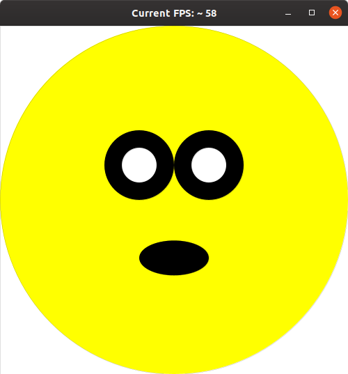

# U07 | Hello Graphics App

In dieser Aufgabe können Sie erste Erfahrungen mit der GraphicsApp sammeln. Zeichnen Sie einen überraschten Smiley, wie in der folgenden Abbildung dargestellt.

| Dieses Bild soll gezeichnet werden. |
|:------:|
|  |

- Ihr Programm startet in der Methode `public void initalize()`. Das Zeichnen des Gesichts soll in der Methode `draw` druchgeführt werden.

- Zerlegen Sie das Problem in Teilprobleme und erstellen zuerst die Aufrufe für die Methoden `setupCanvas()` und `drawSmiley()` in den vorhandenen Methoden `initalize()` und `draw()`.

- Fügen Sie dann die Methoden in der Graphics-App hinzu und setzen Sie in `setupCanvas()` dort die Hintergrundfarbe und die Breite und Höhe der Zeichenflächeauf 500 Pixel.

- Der Smiley muss zentriert auf der Zeichenfläche dargestellt werden, unabhängig von der Größe des Zeichenfelds! Verwenden Sie geeignete Konstanten (vgl. Beispielcode aus der Vorlesung), um die Breite und Höhe an einer einzigen Stelle in Ihrem Programm zu definieren. Alle anderen Stellen, an denen diese Werte gebraucht werden müssen sich auf diese zentrale Stelle beziehen!

- Die Größe des Smileys können Sie frei wählen.

- Nutzen Sie zum Zeichnen des Smiley bzw. den einzelnen Teilen des Gesichts Ellipsen mit unterschiedlicher Größe, Farbe und Position.
